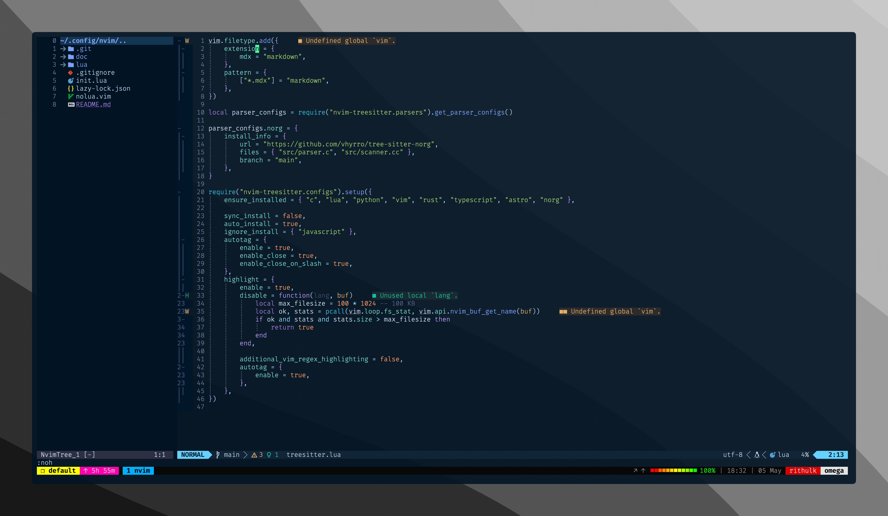

## nvim

Fast, Minimal and pretty neovim config to fuel my arch setup. Parts of this config has been adapted from [Josean's Config](https://www.josean.com/posts/how-to-setup-neovim-2024), Hats off for the modular structure.

Refer to [Docs](https://github.com/rithulkamesh/nvim/blob/main/doc/readme.md) for more info.
